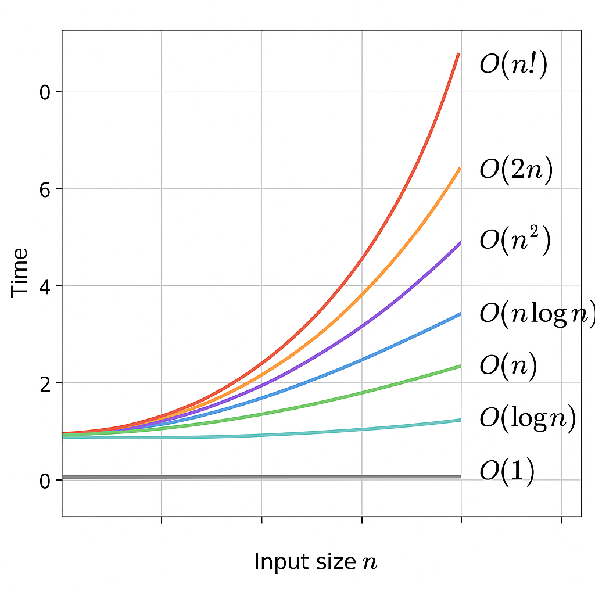

# Algorithm Time Complexities (Big O)

This document explains common Big O notations used to describe the time complexity of algorithms. Big O gives an upper bound on how the runtime of an algorithm grows relative to the input size `n`.

---

Here’s a reference of common Big-O time complexities:

---

## O(1) — Constant Time
- Description: The runtime does not depend on the input size. It always takes the same time.
- Example: Accessing an element in an array by index.
arr = [1, 2, 3, 4, 5]
x = arr[2]  # O(1)

---

## O(log n) — Logarithmic Time
- Description: The runtime grows logarithmically with the input size. Typically occurs in algorithms that divide the problem in half each step.
- Example: Binary search.
def binary_search(arr, target):
    left, right = 0, len(arr)-1
    while left <= right:
        mid = (left + right) // 2
        if arr[mid] == target:
            return mid
        elif arr[mid] < target:
            left = mid + 1
        else:
            right = mid - 1

---

## O(n) — Linear Time
- Description: The runtime grows linearly with the input size. Each element is visited once.
- Example: Summing elements in a list.
total = 0
for x in arr:
    total += x

---

## O(n log n) — Linearithmic Time
- Description: Combines linear and logarithmic growth. Common in efficient sorting algorithms.
- Example: Merge sort, quicksort (average case).
arr.sort()  # Python built-in sort uses O(n log n)

---

## O(n²) — Quadratic Time
- Description: The runtime grows proportionally to the square of the input size. Common in algorithms with nested loops.
- Example: Bubble sort, selection sort.
for i in range(n):
    for j in range(n):
        # Do some operation

---

## O(n³) — Cubic Time
- Description: The runtime grows proportionally to the cube of the input size. Occurs in algorithms with three nested loops.
- Example: Triple nested loops, naive matrix multiplication.

---

## O(2^n) — Exponential Time
- Description: The runtime doubles with each additional input element. Common in recursive solutions without memoization.
- Example: Recursive Fibonacci sequence.
def fib(n):
    if n <= 1:
        return n
    return fib(n-1) + fib(n-2)

---

## O(n!) — Factorial Time
- Description: The runtime grows factorially. Often occurs in algorithms that generate all permutations.
- Example: Solving the Traveling Salesman Problem by brute force.

---

## Quick Reference Table

| Complexity | Growth example |
|------------|----------------|
| O(1)       | Constant       |
| O(log n)   | 1, 2, 3, 4…   |
| O(n)       | 1, 2, 3, 4…   |
| O(n log n) | Sorting       |
| O(n²)      | Nested loops  |
| O(n³)      | Triple loops  |
| O(2^n)     | Fibonacci     |
| O(n!)      | Permutations  |

---

Note: Big O describes **asymptotic behavior** — how an algorithm scales for very large inputs. Constant factors and lower-order terms are ignored.
